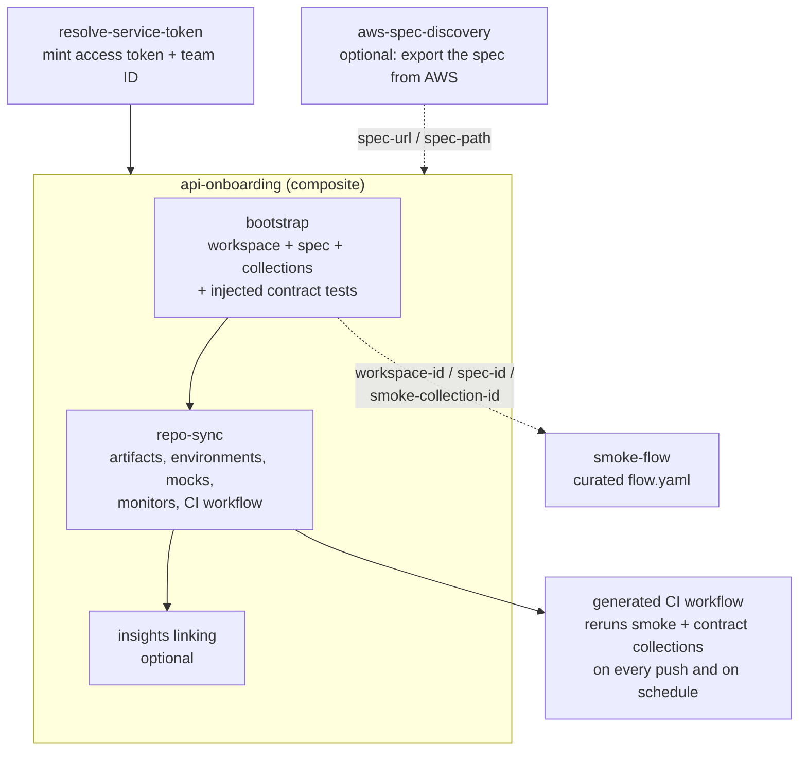

# Postman Customer Success Engineering

We build open-source tooling and automation for API lifecycle management, helping enterprise teams onboard, govern, and scale their API programs with Postman.

## The Postman Enterprise Automation Suite

These actions form an onboarding pipeline that takes a service from an OpenAPI spec to a fully provisioned Postman workspace: spec upload, generated collections with executable contract tests, repo-synced artifacts, a CI loop that reruns the tests on every push, and API Catalog visibility. Each can also run standalone.

| Action | Description |
|--------|-------------|
| [postman-resolve-service-token-action](https://github.com/postman-cs/postman-resolve-service-token-action) | Mint a service-account access token, resolve the team ID, and optionally write both to repo secrets |
| [postman-aws-spec-discovery-action](https://github.com/postman-cs/postman-aws-spec-discovery-action) | Discover AWS-backed services (API Gateway, AppSync, IaC, etc.) and export their OpenAPI specs |
| [postman-api-onboarding-action](https://github.com/postman-cs/postman-api-onboarding-action) | Composite orchestrator: runs bootstrap, repo sync, and Insights linking end to end |
| [postman-bootstrap-action](https://github.com/postman-cs/postman-bootstrap-action) | Workspace provisioning, spec upload, collection generation, governance, and contract-test injection |
| [postman-smoke-flow-action](https://github.com/postman-cs/postman-smoke-flow-action) | Apply a curated flow.yaml to the Smoke collection created by bootstrap |
| [postman-repo-sync-action](https://github.com/postman-cs/postman-repo-sync-action) | Sync collections, environments, mocks, and monitors back to the repo, link the workspace to it, and generate the CI test loop |
| [postman-insights-onboarding-action](https://github.com/postman-cs/postman-insights-onboarding-action) | Link Postman Insights discovered services to API Catalog workspaces |

`postman-api-gateway-sync` is deprecated and archived. Use `postman-aws-spec-discovery-action` instead.

## Suggested sequence

1. Run `postman-resolve-service-token-action` first. It mints the service-account access token and resolves the team ID that the rest of the pipeline consumes, and it can refresh tokens on a schedule.
2. Add `postman-aws-spec-discovery-action` when the OpenAPI spec lives in AWS (API Gateway, AppSync, IaC exports). Its output feeds the onboarding action's `spec-url` input.
3. Call `postman-api-onboarding-action` for the standard path. The composite orchestrates bootstrap, repo sync, and Insights linking in order; the individual actions remain available when you need finer control.
4. Finish with `postman-smoke-flow-action` to apply a curated `flow.yaml` to the canonical Smoke collection, using the `workspace-id`, `spec-id`, and `smoke-collection-id` outputs from bootstrap.

## Standards-grounded contract testing

The pipeline does not just provision assets; it leaves executable tests behind. Every generated collection ships with contract assertions compiled from your spec, and the generated CI workflow replays them against your live API (or a Postman mock) on every push, pull request, and schedule.

- **Grounded in the standards, not heuristics.** JSON Schema (draft-07 / 2020-12) body validation with RFC-checked formats (RFC 3339 timestamps, RFC 4122 UUIDs, RFC 3986 URIs), plus RFC 9110 status-code, framing, and field-syntax requirements, RFC 9457 `problem+json` error bodies, RFC 6265 `Set-Cookie`, RFC 6797 HSTS, WHATWG Fetch CORS, RFC 9651 structured fields, RFC 9421 message signatures, RFC 9530 body digests, and more. The full per-check inventory with the standard behind each test: [Generated Assertions](https://github.com/postman-cs/postman-bootstrap-action/blob/main/docs/generated-assertions.md).
- **Beyond REST.** gRPC (proto3 JSON well-known types, metadata/trailer conformance), SOAP 1.1/1.2 with WS-I Basic Profile checks, GraphQL-over-HTTP with type-system schema validation, AsyncAPI WebSocket / Socket.IO / MQTT message validation, and MCP server-manifest contracts with a runnable Streamable HTTP lane: [Multi-Protocol Contract Assertions](https://github.com/postman-cs/postman-bootstrap-action/blob/main/docs/MULTIPROTOCOL-ASSERTIONS.md).
- **Two enforcement layers over one contract.** Static document lints catch the spec lying at bootstrap time (a HEAD operation declaring a body, a 304 on a POST); the injected `pm.test()` assertions catch the server lying on every CI run (a 200 where only 201 is declared, a body that fails its schema). Neither subsumes the other: [Contract Enforcement Layers](https://github.com/postman-cs/postman-bootstrap-action/blob/main/docs/contract-enforcement-layers.md).

## Worked examples

| Repo | What it shows |
|------|---------------|
| [postman-compile-time-assertions-demo](https://github.com/postman-cs/postman-compile-time-assertions-demo) | Pre-merge API contract gate built on the actions above: CI builds the service, replays the generated smoke and contract collections against it, and fails the PR on schema drift |
| [postman-service-account-onboarding-sample](https://github.com/postman-cs/postman-service-account-onboarding-sample) | Minimal workflow wiring the token mint into the composite onboarding action |

## Links

- [postman.com](https://www.postman.com)
- [Postman Learning Center](https://learning.postman.com)
